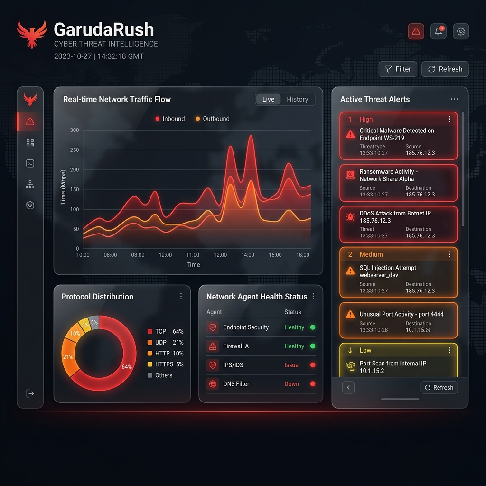
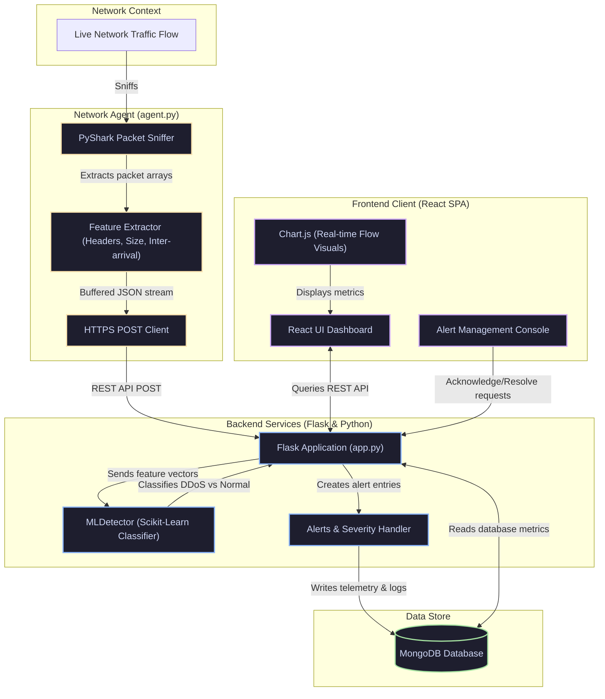

# 🦅 GarudaRush - ML-Enhanced DDoS Detection System

A comprehensive, production-ready web application for real-time network traffic monitoring and DDoS attack detection using machine learning.

<br/>

<p align="center">
  
</p>

<br/>

## ✨ Features

### 🔐 Authentication & Security
- Secure JWT-based authentication
- User registration and login
- Password strength validation
- Protected routes
- User profile management

### 📊 Dashboard
- Real-time traffic monitoring with live charts
- System metrics and statistics
- ML model performance metrics
- Attack distribution visualization
- Agent status monitoring
- Detection statistics

### 🚨 Alerts Management
- Real-time security alerts
- Filter by severity, status, and attack type
- Acknowledge and resolve alerts
- Alert summaries and trends
- Detailed alert information

### 📡 Traffic Monitoring
- Live traffic flow visualization
- Protocol distribution analysis
- Traffic statistics and metrics
- Historical data export
- Time range filtering

### ⚙️ Settings
- Profile management
- Password change
- User preferences
- Theme customization

## 🛠️ Tech Stack

### Frontend
- **React 18** - UI framework
- **React Router** - Navigation
- **Chart.js** - Data visualization
- **Axios** - HTTP client
- **React Toastify** - Notifications
- **CSS3** - Modern styling

### Backend
- **Flask** - Python web framework
- **MongoDB** - Database
- **JWT** - Authentication
- **PyShark** - Network packet capture
- **Scikit-learn** - Machine learning
- **NumPy/Pandas** - Data processing

## 📋 Prerequisites

- Python 3.8+
- Node.js 16+
- MongoDB 4.4+
- npm or yarn

## 🚀 Installation

### Backend Setup

1. Navigate to the backend directory:
```bash
cd backend
```

2. Create a virtual environment:
```bash
python -m venv venv
source venv/bin/activate  # On Windows: venv\Scripts\activate
```

3. Install dependencies:
```bash
pip install -r requirements.txt
```

4. Create a `.env` file in the backend directory:
```env
SECRET_KEY=your-secret-key-here
JWT_SECRET_KEY=your-jwt-secret-key-here
MONGO_URI=mongodb://localhost:27017/garudarush
MONGO_DB_NAME=garudarush
FRONTEND_URL=http://localhost:3000
PORT=5000
FLASK_ENV=development
```

5. Start the backend server:
```bash
python app.py
```

The backend will run on `http://localhost:5000`

### Frontend Setup

1. Navigate to the frontend directory:
```bash
cd frontend
```

2. Install dependencies:
```bash
npm install
```

3. Create a `.env` file in the frontend directory:
```env
REACT_APP_API_URL=http://localhost:5000/api
```

4. Start the development server:
```bash
npm start
```

The frontend will run on `http://localhost:3000`

## 📁 Project Structure

```
garudarush/
├── backend/
│   ├── app.py                 # Flask application entry point
│   ├── agent.py              # Network monitoring agent
│   ├── requirements.txt     # Python dependencies
│   ├── routes/
│   │   ├── auth.py          # Authentication routes
│   │   ├── dashboard.py     # Dashboard routes
│   │   ├── traffic.py       # Traffic monitoring routes
│   │   └── alerts.py        # Alerts routes
│   └── services/
│       └── ml_detector.py   # ML detection service
│
└── frontend/
    ├── public/
    │   └── index.html
    ├── src/
    │   ├── App.js           # Main app component
    │   ├── components/
    │   │   ├── Auth/        # Login/Register components
    │   │   ├── Dashboard/   # Dashboard component
    │   │   ├── Alerts/      # Alerts component
    │   │   ├── Traffic/     # Traffic component
    │   │   ├── Settings/    # Settings component
    │   │   └── Layout/      # Navigation layout
    │   └── services/
    │       └── api.js       # API service layer
    └── package.json
```

## 🎯 Usage

### Starting the Application

1. **Start MongoDB**:
```bash
mongod
```

2. **Start Backend** (in backend directory):
```bash
python app.py
```

3. **Start Frontend** (in frontend directory):
```bash
npm start
```

4. **Access the Application**:
   - Open your browser and navigate to `http://localhost:3000`
   - Register a new account or login
   - Explore the dashboard and features

### Running the Network Agent

To monitor network traffic, run the agent:

```bash
python backend/agent.py \
  --agent-id agent-001 \
  --interface eth0 \
  --api-url http://localhost:5000/api \
  --username your-email@example.com \
  --password your-password
```

**Note**: On Windows, you may need to use a different interface name (e.g., `Wi-Fi`, `Ethernet`) or use WSL.

## 🔧 Configuration

### Backend Configuration

Edit the `.env` file in the backend directory to configure:
- Database connection
- JWT secrets
- CORS settings
- Port numbers

### Frontend Configuration

Edit the `.env` file in the frontend directory to configure:
- API endpoint URL

## 📊 API Endpoints

### Authentication
- `POST /api/auth/register` - Register new user
- `POST /api/auth/login` - User login
- `GET /api/auth/me` - Get current user
- `PUT /api/auth/update-profile` - Update profile
- `POST /api/auth/change-password` - Change password

### Dashboard
- `GET /api/dashboard/overview` - Get dashboard overview
- `GET /api/dashboard/real-time-metrics` - Get real-time metrics
- `GET /api/dashboard/agent-status` - Get agent status

### Traffic
- `GET /api/traffic/stats` - Get traffic statistics
- `GET /api/traffic/live` - Get live traffic data
- `POST /api/traffic/submit` - Submit traffic data
- `GET /api/traffic/export` - Export traffic data

### Alerts
- `GET /api/alerts/` - Get alerts
- `POST /api/alerts/create` - Create alert
- `POST /api/alerts/:id/acknowledge` - Acknowledge alert
- `POST /api/alerts/:id/resolve` - Resolve alert
- `GET /api/alerts/summary` - Get alerts summary

## 🎨 Features Overview

### Dashboard
- Real-time traffic visualization
- System health metrics
- ML model performance
- Attack distribution charts
- Agent monitoring

### Alerts
- Filterable alert list
- Severity-based categorization
- Alert acknowledgment workflow
- Detailed attack information

### Traffic
- Live traffic flow charts
- Protocol distribution
- Historical data analysis
- CSV export functionality

### Settings
- Profile management
- Security settings
- User preferences

## 🧪 Testing

### Backend Tests
```bash
cd backend
pytest
```

### Frontend Tests
```bash
cd frontend
npm test
```

## 🐛 Troubleshooting

### MongoDB Connection Issues
- Ensure MongoDB is running: `mongod`
- Check connection string in `.env`
- Verify MongoDB port (default: 27017)

### Frontend API Errors
- Verify backend is running on port 5000
- Check `REACT_APP_API_URL` in frontend `.env`
- Ensure CORS is properly configured

### Network Agent Issues
- Verify network interface name
- Check agent authentication credentials
- Ensure backend API is accessible

## 📐 System Architecture

The diagram below maps out how the remote python sniffer intercepts network flows, processes and streams features to the Flask API, runs the classifier, and triggers alerts on the React frontend dashboard:



---

## 🧠 Machine Learning Detection Engine

To detect active DDoS patterns instead of setting crude request thresholds, GarudaRush uses a supervised machine learning classification pipeline.

### Feature Extraction (Network Agent)
The network sniffer (`agent.py`) runs in a separate thread. It intercepts packet traffic using **PyShark** and aggregates them into statistical network flows:
1. **Flow Duration**: Microsecond duration of a continuous transaction window.
2. **Packet Count**: Total incoming packets within the window.
3. **Payload Size Variance**: Highlights anomalous bulk volumetric changes.
4. **Inter-Arrival Time (IAT)**: Evaluates packet spacing (low spacing implies automated flood request scripts).

### Threat Classification (Backend Service)
- **Model**: Scikit-Learn classification algorithms (optimized Random Forest / SVM) loaded inside `ml_detector.py`.
- **Real-Time Scoring**: For each request block posted by remote agents, the Flask backend computes threat probabilities.
- **Alert Escalation**: If threat certainty exceeds a configurable threshold (e.g., 90%), a high-severity alert is raised, saving the malicious IP, timestamp, and signature to the MongoDB cluster.

---

## 👥 Contributors

This project was developed by the Capstone Project Team:
- **Parshav Shah**
- **Sourav Rinwa**
- **Arvind Sharma**

---

## 🙏 Acknowledgments

- **Flask** & **React** communities for framework design.
- **PyShark** team for providing a robust Python interface to tshark.
- **Chart.js** for interactive live metrics visualizations.
- **MongoDB** for high-throughput unstructured event storage.

---

## 📝 License

Distributed under the MIT License. See `LICENSE` for more information.
